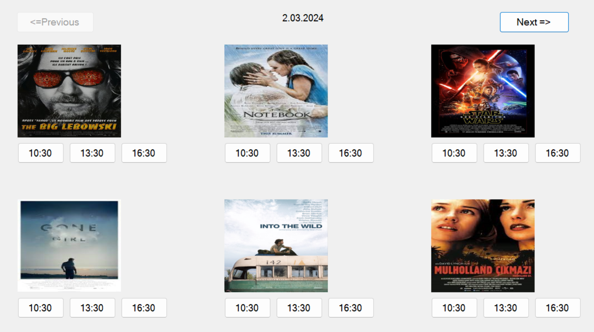

The Cinema Ticket Booking System is a desktop application developed in C# with Windows Forms and follows the MVC (Model-View-Controller) architecture.
This system allows users to interact with a cinema ticket booking system through a user-friendly interface.

